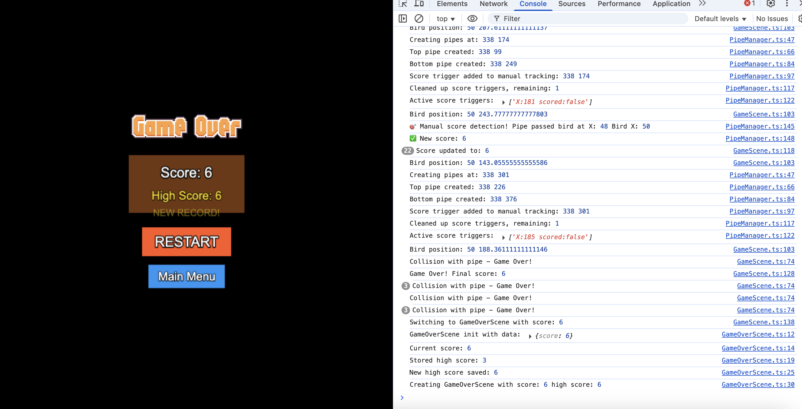

# 🐦 Flappy Bird Game

A modern implementation of the classic Flappy Bird game built with **Phaser 3**, **TypeScript**, and **Rollup**. Features include physics-based gameplay, score tracking, high score persistence, and responsive controls.


## 🎮 Game Features

- **🎯 Physics-based gameplay** with realistic bird movement and gravity
- **🏆 Score system** with manual position tracking for accurate scoring
- **💾 High score persistence** using localStorage
- **🎵 Sound effects** for flap, score, and collision events
- **📱 Responsive controls** supporting both mouse clicks and keyboard input
- **🎨 Smooth animations** with bird sprite animations and background scrolling
- **🔄 Scene management** with Menu, Game, and Game Over screens
- **⚡ Optimized performance** with efficient collision detection

## 🏗️ Project Architecture

<div style="display: flex; gap: 20px; align-items: center;">
    
    
</div>

### Directory Structure

```
flappy-bird-game/
├── src/
│   ├── assets/
│   │   ├── images/          # Game sprites and textures
│   │   └── audio/           # Sound effects
│   ├── config/
│   │   └── gameConfig.ts    # Game configuration constants
│   ├── objects/
│   │   ├── Bird.ts          # Bird class with physics and animations
│   │   ├── PipeManager.ts   # Pipe generation and scoring logic
│   │   └── Background.ts    # Background and ground management
│   ├── scenes/
│   │   ├── BootScene.ts     # Asset loading scene
│   │   ├── MenuScene.ts     # Main menu scene
│   │   ├── GameScene.ts     # Main gameplay scene
│   │   └── GameOverScene.ts # Game over and restart scene
│   └── game.ts              # Main game entry point
├── dist/                    # Built game files
├── rollup.config.js         # Build configuration
├── copy-assets.js           # Asset copying script
└── package.json             # Dependencies and scripts
```

### Class Architecture Diagram


### Core Components

#### 🎮 **GameScene** - Main Game Controller

- Orchestrates all game objects and systems
- Handles input events and collision detection
- Manages game state (playing, paused, game over)
- Coordinates between Bird, PipeManager, and Background

#### 🐦 **Bird Class** - Player Character

- Physics-based movement with gravity and flap mechanics
- Sprite animation system with multiple bird states
- Collision body management and rotation effects
- Sound effect integration for flap actions

#### 🏗️ **PipeManager** - Obstacle System

- **Manual Score Detection Algorithm**: Custom position tracking system
- Dynamic pipe generation with randomized gap positions
- Efficient cleanup of off-screen pipes
- Score trigger management without physics overlap

#### 🎯 **Manual Scoring Algorithm**

```typescript
// Core scoring logic
private checkScoreManually(): void {
    const birdX = 50; // Fixed bird position

    this.scoreTriggers.forEach(trigger => {
        // Update trigger position (pipes move left)
        trigger.x += GameConfig.pipes.speed * deltaTime;

        // Score when pipe passes bird
        if (!trigger.scored && trigger.x <= birdX && trigger.x > birdX - 50) {
            trigger.scored = true;
            this.passedPipes++;
            this.scene.events.emit('score-updated', this.passedPipes);
        }
    });
}
```

## 🛠️ Technologies Used

| Technology        | Version | Purpose                          |
| ----------------- | ------- | -------------------------------- |
| **Phaser 3**      | 3.60.0  | Game engine and physics          |
| **TypeScript**    | 5.0.0   | Type-safe JavaScript development |
| **Rollup**        | 3.20.0  | Module bundler and build tool    |
| **Node.js**       | 20.x    | Development environment          |
| **HTML5 Canvas**  | -       | Rendering and graphics           |
| **Web Audio API** | -       | Sound effects                    |
| **localStorage**  | -       | High score persistence           |

### Build Tools & Plugins

- `@rollup/plugin-typescript` - TypeScript compilation
- `@rollup/plugin-node-resolve` - Module resolution
- `@rollup/plugin-commonjs` - CommonJS support
- `rollup-plugin-serve` - Development server
- `rollup-plugin-livereload` - Hot reload

## 🚀 Setup & Installation

### Prerequisites

- **Node.js** (v16 or higher)
- **npm** or **yarn**
- Modern web browser with HTML5 support

### Installation Steps

1. **Clone the repository**

   ```bash
   git clone <repository-url>
   cd flappy-bird-game
   ```

2. **Install dependencies**

   ```bash
   npm install
   ```

3. **Build the project**

   ```bash
   npm run build
   ```

4. **Start development server**

   ```bash
   # Option 1: Using built-in serve script
   npm run serve

   # Option 2: Using Python HTTP server
   cd dist && python3 -m http.server 8080

   # Option 3: Using Node.js http-server
   npx http-server dist -p 8080
   ```

5. **Open in browser**
   ```
   http://localhost:8080
   ```

### Development Workflow

```bash
# Development with hot reload
npm run dev

# Production build
npm run build

# Serve built files
npm run serve
```

## 🎯 Game Mechanics

### Physics System

- **Gravity**: 700 pixels/second²
- **Flap Strength**: -350 pixels/second (upward velocity)
- **Pipe Speed**: -200 pixels/second (leftward movement)
- **Bird Position**: Fixed at X=50, dynamic Y position

### Scoring Algorithm

The game uses a **manual position tracking system** instead of Phaser's built-in collision detection for more reliable scoring:

1. **Score triggers** are created at each pipe's X position
2. **Triggers move** with the same velocity as pipes (-200 px/s)
3. **Score increments** when trigger.x ≤ bird.x (pipe passes bird)
4. **Duplicate prevention** using scored boolean flags

### Collision Detection

- **Pipe Collision**: Phaser physics collision between bird and pipe sprites
- **Ground Collision**: Static collision with ground boundary
- **Boundary Collision**: World bounds to prevent bird from leaving screen

## 📊 Performance Optimizations

- **Object Pooling**: Efficient pipe creation and destruction
- **Manual Score Detection**: Eliminates physics overhead for scoring
- **Asset Preloading**: All assets loaded in BootScene
- **Cleanup System**: Automatic removal of off-screen objects
- **Optimized Animations**: Lightweight sprite animations

## 🎨 Assets

### Images

- **Bird Sprites**: 3-frame animation (up, mid, down flap)
- **Pipe Texture**: Scalable pipe segments
- **Background**: Scrolling sky and ground textures
- **UI Elements**: Game over screen and buttons

### Audio

- **Flap Sound**: Bird wing flap effect
- **Score Sound**: Point scoring notification
- **Hit Sound**: Collision impact effect

## 🏆 High Score System

The game implements persistent high score storage using browser's localStorage:

```typescript
// Save high score
localStorage.setItem("flappyHighScore", String(highScore));

// Load high score
const storedScore = localStorage.getItem("flappyHighScore");
const highScore = storedScore ? parseInt(storedScore) : 0;
```

Features:

- **Persistent storage** across browser sessions
- **New record detection** with visual feedback
- **Cross-session continuity** - scores survive browser restarts

## 🎮 Controls

| Input           | Action                                 |
| --------------- | -------------------------------------- |
| **Mouse Click** | Flap bird wings                        |
| **Spacebar**    | Flap bird wings                        |
| **ESC**         | Return to main menu (Game Over screen) |

## 🐛 Troubleshooting

### Common Issues

1. **Assets not loading**

   ```bash
   # Ensure assets are copied after build
   npm run build
   ```

2. **Score not incrementing**

   - Check browser console for manual score detection logs
   - Verify bird and pipe positions in debug output

3. **Sound not playing**

   - Ensure browser allows audio autoplay
   - Check audio file paths in BootScene

4. **Build errors**
   ```bash
   # Clean install
   rm -rf node_modules package-lock.json
   npm install
   npm run build
   ```

## 🔧 Configuration

Game settings can be modified in `src/config/gameConfig.ts`:

```typescript
export const GameConfig = {
  width: 288, // Game canvas width
  height: 512, // Game canvas height
  physics: { gravity: 700 }, // Gravity strength
  bird: {
    initialPosition: { x: 50, y: 250 },
    flapStrength: -350, // Upward velocity on flap
    rotation: { up: -0.5, down: 0.5 },
  },
  pipes: {
    speed: -200, // Horizontal movement speed
    spacing: {
      horizontal: 200, // Distance between pipe pairs
      vertical: 150, // Gap size between top/bottom pipes
    },
  },
};
```

## 📈 Future Enhancements

- [ ] **Mobile touch controls** with responsive design
- [ ] **Multiple bird skins** and customization options
- [ ] **Power-ups system** (shield, slow motion, double points)
- [ ] **Particle effects** for enhanced visual feedback
- [ ] **Background music** and enhanced audio
- [ ] **Online leaderboard** with backend integration
- [ ] **Progressive difficulty** with increasing pipe speed
- [ ] **Achievement system** with unlockable content

## 📄 License

This project is licensed under the MIT License - see the [LICENSE](LICENSE) file for details.

## 🤝 Contributing

1. Fork the repository
2. Create a feature branch (`git checkout -b feature/amazing-feature`)
3. Commit your changes (`git commit -m 'Add amazing feature'`)
4. Push to the branch (`git push origin feature/amazing-feature`)
5. Open a Pull Request

## 🙏 Acknowledgments

- **Phaser.js** community for excellent documentation
- **Original Flappy Bird** by Dong Nguyen for game inspiration
- **TypeScript** team for robust typing system
- **Rollup** for efficient bundling solution

---

**Built with ❤️ using Phaser 3 + TypeScript**

_Happy Gaming! 🎮_
